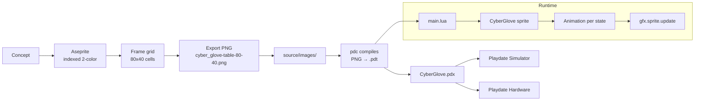

# Cyber Glove Sprite Starter (Playdate SDK)

Working starter that loads a 1-bit cyber glove imagetable, drives an animated
sprite from buttons + crank, and runs in the Playdate simulator.

```
playdate_sprite_starter/
├── installer.sh
├── requirements.txt
├── README.md
└── source/
    ├── pdxinfo
    ├── main.lua
    ├── core/
    │   ├── Animation.lua
    │   └── Input.lua
    ├── entities/
    │   └── CyberGlove.lua
    └── images/
        └── cyber_glove-table-80-40.png   (PLACEHOLDER — swap me for real art)
```

> **Note:** `source/images/cyber_glove-table-80-40.png` ships as a procedurally
> generated placeholder so the scaffold compiles and boots immediately. Each
> per-state row uses a distinguishable silhouette (closed glove, open palm,
> scan cone, lightning, crack lines) drawn from geometric primitives — NOT
> stick figures. Real artists should overwrite it; see §6 for the export
> workflow. To regenerate the placeholder:
>
> ```bash
> node scripts/generate_cyber_glove_placeholder.js
> ```

## 1. Playdate sprite fundamentals

A **sprite** is an on-screen object the engine tracks for you. You give it an
image, a position, a z-order, and a collision rect. The engine adds it to a
display list. Each frame you call `playdate.graphics.sprite.update()` once and
it redraws every dirty sprite plus the background callback, in z-order, with
clean clipping.

`playdate.graphics.sprite` is a class. Subclass it (`class("Foo").extends(gfx.sprite)`),
then in `init` call `:setImage()`, `:setCenter()`, `:moveTo()`, `:setZIndex()`,
and `:setCollideRect()`. Call `:add()` to insert it into the display list.

**Images** are loaded with `playdate.graphics.image.new(path)`. Paths are
relative to the `source/` root, without the `.png` extension. The SDK compiles
PNGs into `.pdi` at build time.

**Image tables** are sprite sheets. The SDK auto-slices a file named
`name-table-W-H.png` into equal `W × H` frames, indexed left-to-right then
top-to-bottom starting at 1. Load with `playdate.graphics.imagetable.new("name")`
and access frames with `:getImage(i)`. The compiled output is `.pdt`.

**Collision rectangles** are independent of the image. Set them tight to the
visible silhouette with `:setCollideRect(x, y, w, h)`. Use `:moveWithCollisions()`
or `:checkCollisions()` instead of `:moveTo()` when you want physics-style
resolution. `collisionResponse(other)` returns one of `kCollisionTypeOverlap`,
`kCollisionTypeSlide`, `kCollisionTypeFreeze`, `kCollisionTypeBounce`.

**Update loops:** `playdate.update()` runs every frame. Your game state goes
there, then `playdate.timer.updateTimers()` (if you use timers), then exactly
one `gfx.sprite.update()`. Don't draw inside `playdate.update()` directly —
draw inside sprite `:draw()` overrides or the background callback.

**Animation frames** are advanced by you. The SDK has `gfx.animation.loop`
helpers, but a small class (see `core/Animation.lua`) gives you per-state
frame lists, fps, and looping flags without dragging in extra dependencies.
Each tick you compute the new frame index from elapsed ms and call
`sprite:setImage(table:getImage(idx))`.

**Draw order** is the sprite z-index. Higher draws on top. Background callback
draws below all sprites. Use `gfx.sprite.setAlwaysRedraw(false)` (default) and
the engine only redraws dirty regions — keep z-indices stable to benefit.

**1-bit crispness:** Only black, white, and alpha. Never anti-alias. Never
use grayscale. Author at 1× resolution. If you up-sample for previews, always
use nearest-neighbor. The Playdate screen is 400×240 at ~173 DPI — pixels are
small but sharp, so a single misplaced gray pixel reads as noise.

## 2. Asset plan

| Use case                     | Size       | Notes                                         |
|------------------------------|------------|-----------------------------------------------|
| HUD icon, tiny pickup        | 16×16      | One frame is fine                             |
| Generic prop, key, button    | 32×32      | 2–4 frames if it animates                     |
| NPC, small enemy, projectile | 32×32      | Tight silhouette, 1-pixel outline             |
| Player character             | 32×32 or 48×48 | 4–8 frame walk cycle                     |
| Hero hardware (this glove)   | 80×40      | Wide aspect fits glove + cable + module       |
| Mid-boss                     | 64×64      | 8-frame loops                                 |
| Boss / cinematic sprite      | 128×128+   | Sparse animation, hand-tuned dither           |
| Full-screen UI / title card  | 400×240    | Single image, not a sprite                    |

For this project the cyber glove is **80×40** because the body is wider than
it is tall (forearm + glove + ribbon cable + wrist module). 64×32 also works
if you crop the cable.

**Naming convention** (mandatory for imagetables):

```
name-table-W-H.png
```

Where `W` and `H` are the frame size in pixels. Example:

```
images/cyber_glove-table-80-40.png
images/scan_pulse-table-16-16.png
images/ui_cursor-table-8-8.png
```

**Folder structure:**

```
source/
├── images/      # PNG sprite sheets and single images
├── sounds/      # WAV/MP3
├── core/        # framework code (Animation, Input, etc)
└── entities/    # one file per game object
```

## 3. Sprite sheet layout — `cyber_glove-table-80-40.png`

Total canvas: **320 × 200 px** (4 columns × 5 rows of 80×40 frames).

```
       col 0          col 1          col 2          col 3
row 0  idle_0         idle_1         idle_2         idle_3
row 1  activate_0     activate_1     activate_2     activate_3
row 2  scan_0         scan_1         scan_2         scan_3
row 3  overload_0     overload_1     overload_2     overload_3
row 4  damaged_0      damaged_1      damaged_2      icon_0
```

Frame indices the SDK assigns (left-to-right, top-to-bottom, 1-based):

| State    | Indices         |
|----------|-----------------|
| idle     | 1, 2, 3, 4      |
| activate | 5, 6, 7, 8      |
| scan     | 9, 10, 11, 12   |
| overload | 13, 14, 15, 16  |
| damaged  | 17, 18, 19      |
| icon     | 20              |

`entities/CyberGlove.lua` resolves these indices from `row * 4 + frame`.

## 4. Lua code

See:
- `source/main.lua`
- `source/core/Animation.lua`
- `source/core/Input.lua`
- `source/entities/CyberGlove.lua`

## 5. Behavior

- D-pad moves the glove (clamped to screen, with sprite half-width margin).
- A button: plays the `activate` animation once, then returns to `idle`.
- B button: enters `overload` for 900 ms, then drops to `damaged`.
- Crank: enters `scan` while turning, scrubs scan frames in proportion to the
  crank angle (one frame per 18°), and returns to `idle` after 250 ms of no
  movement.
- Collision rect is 56×28, centered on the 80×40 image — smaller than the
  visual sprite so wires and cables don't trigger false hits.

## 6. Exporting the art

**Aseprite** is the standard tool. Pixaki, Piskel, and GIMP all work too.

1. **New file** — 320 × 200 px, color mode **Indexed**, palette **2 colors**
   (pure black 0,0,0 and pure white 255,255,255). Background **transparent**.
2. **Grid** — `Edit → Preferences → Grid → 80 × 40 px`. Toggle with `'`.
3. **Draw at 1× zoom.** Pencil tool only. No brushes with soft edges. No
   smoothing. No spray. Disable RotSprite for rotations; use nearest only.
4. **Layers** — one layer per state is helpful, but flatten before export.
5. **Export** — `File → Export Sprite Sheet`:
   - Layout: **By rows**
   - Sheet type: **Packed** off (we want a fixed grid)
   - Sheet width: 320, height: 200
   - Frame size: 80×40
   - Output: `source/images/cyber_glove-table-80-40.png`
6. **Verify** — open the PNG in any viewer. Confirm only two colors plus
   transparency. If you see gray pixels, your tool anti-aliased somewhere.
   In Aseprite, `Sprite → Color Mode → Indexed` purges them.

**How Playdate compiles PNG assets:** at build time, `pdc source/ build/`
walks `source/`, finds `.png` files, converts each into a Playdate Image
(`.pdi`) or Imagetable (`.pdt`) inside `build/CyberGlove.pdx/`. Files
matching `name-table-W-H.png` are sliced into `name-table-W-H.pdt`. You
reference them in Lua **by name without extension**, e.g.
`imagetable.new("images/cyber_glove")`.

**How to avoid anti-aliasing**:
- Indexed color mode with 2 colors
- Pencil tool, 1px size
- No alpha blending
- Export as 8-bit PNG; never JPEG

## 7. Quality checklist

- [ ] Silhouette readable at 1× without squinting
- [ ] Only pure black, pure white, fully transparent pixels (no gray)
- [ ] No anti-aliased edges anywhere in the sheet
- [ ] Details survive without scaling (no 1-pixel checkerboards that smear)
- [ ] Animation reads at 2–4 frames per cycle
- [ ] Collision box smaller than the visual sprite (wires/cables excluded)
- [ ] Sheet is exactly 320×200; every frame fills its 80×40 cell
- [ ] Runs on real Playdate hardware, not just the simulator

## 8. Workflow



## 9. Simulator run instructions

```bash
# 1. install + verify SDK
./installer.sh

# 2. compile
"$PLAYDATE_SDK_PATH/bin/pdc" source build/CyberGlove.pdx

# 3. launch in simulator
"$PLAYDATE_SDK_PATH/bin/PlaydateSimulator" build/CyberGlove.pdx     # Linux
# or, on macOS:
open -a "Playdate Simulator" build/CyberGlove.pdx
```

Controls in the simulator:
- Arrow keys: d-pad
- **Z**: A button
- **X**: B button
- **Mouse drag** on the dial UI or **left/right arrows with Ctrl held**:
  crank rotation (varies per SDK version; check simulator menu)
